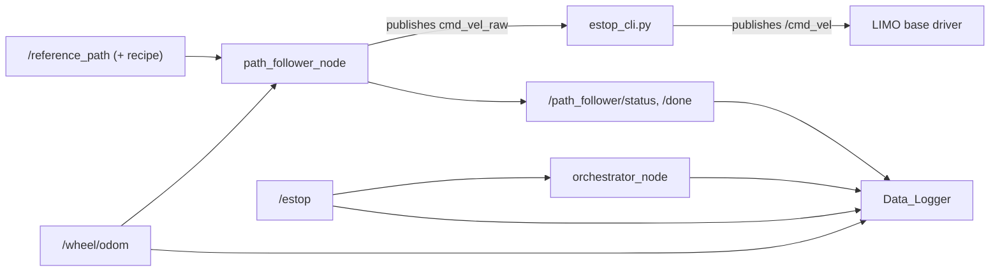

# Deployment & Runbook — NUC

How the stack gets onto a NUC and what each support script does. Pairs with
`CLAUDE.md` (dev cycle, ssh/rsync, build/run commands) and `system_spec.md`
(the interface contract the deployed system must satisfy).

## NUC deployment caveats

These four things are non-obvious and will re-bite anyone setting up a fresh
NUC. Keep them in mind before declaring a runtime environment "ready".

1. **Professor package shipped without `setup.cfg`.** Without the
   `[install] install_scripts=$base/lib/limo_path_follower` redirect, modern
   setuptools installs `console_scripts` into `install/<pkg>/bin/` instead of
   `install/<pkg>/lib/<pkg>/`, and `ros2 run limo_path_follower
   path_follower_node` returns "No executable found". Our fix added
   `scalecar-vfg-h-infinite/ros2_bridge/setup.cfg`. Every other ament_python
   package in `~/agilex_ws/src/` has the same pattern.

2. **`vfg_pathfollowing` is a hard prerequisite, not declared anywhere.**
   The ROS package's `package.xml` only lists `rclpy`, `nav_msgs`,
   `geometry_msgs`. The node imports `vfg_pathfollowing` at the top, so on
   a fresh NUC you must:
   ```
   pip3 install --user ~/H-infinity/scalecar-vfg-h-infinite/
   ```
   before `ros2 run` will succeed. If you skip this the node crashes with
   `ModuleNotFoundError: No module named 'vfg_pathfollowing'`.

3. **`setuptools==68.2.2` is pinned in `~/.local` on the NUC.** Versions
   >= 70 place `console_scripts` in `bin/` regardless of `setup.cfg` and
   silently break `ros2 run` for **all** ament_python packages on the
   workspace. If pip or a system update moves it, reinstall:
   ```
   pip3 install --user --force-reinstall setuptools==68.2.2
   ```

4. **Repo lives outside the colcon tree.** The clone is at `~/H-infinity/`;
   the package is made visible to colcon via a symlink:
   ```
   ln -sfn ~/H-infinity/scalecar-vfg-h-infinite/ros2_bridge \
           ~/agilex_ws/src/limo_path_follower
   ```
   Recreate the symlink if the repo moves.

## Gotchas that will bite you (read before debugging anything)

Each of these has cost real hours. They look like bugs in your code; they are not.

### G1 · `git pull` on the NUC aborts: "untracked working tree files would be overwritten"

**Cause.** Two sync mechanisms overlap. `tools/sync/sync.sh push` rsyncs files
laptop→NUC, where they land **untracked**. When those same paths later arrive as
*tracked* files in a commit, `git pull --ff-only` refuses rather than clobber them.
`git reset` does **not** help — reset does not touch untracked files.

**Symptom.** The NUC sits many commits behind `origin/main` and every pull aborts.
`git status` shows a clean tree, which makes it look like nothing is wrong.

**Fix.** List the real collisions, move them aside, pull:

```bash
cd /home/agilex/H-infinity
git fetch origin main
# NOTE: -uall is required. Plain `git status --porcelain` collapses untracked
# DIRECTORIES into one entry, so files inside them are invisible and you will
# under-count the collisions.
git status --porcelain -uall | awk '/^\?\?/{ $1=""; sub(/^ /,""); print }' | sort > /tmp/untracked.txt
git diff --name-status HEAD origin/main | awk '$1=="A"{ $1=""; sub(/^\t?[ ]?/,""); print }' | sort > /tmp/incoming.txt
comm -12 /tmp/incoming.txt /tmp/untracked.txt > /tmp/collisions.txt

BK=/home/agilex/nuc_untracked_backup_$(date +%Y%m%d-%H%M%S); mkdir -p "$BK"
while IFS= read -r f; do
  [ -f "$f" ] && { mkdir -p "$BK/$(dirname "$f")"; mv "$f" "$BK/$f"; }
done < /tmp/collisions.txt

git pull --ff-only origin main
```

Move, never delete — a colliding file is occasionally a local draft that was never
committed. Diff against `origin/main` before discarding the backup.

**Avoiding it.** Prefer `git pull` on the NUC for *code*, and use `sync.sh push`
only for work that is not committed yet. The two paths fight whenever both carry
the same file.

### G2 · Pin headings render mirrored vs `reposition_node`

The battle-station venue editor and `reposition_node` disagree on heading sign, so
a venue that looks correct on screen can steer the robot the opposite way. Never
trust the rendered arrow alone — verify the commanded heading on the robot before
a run, especially after hand-editing a venue JSON.

### G3 · A duplicate `odom_zero_node` silently corrupts a run

A manually started `ros2 run ... odom_zero_node` left over from an earlier session
keeps publishing alongside the stack's own. Two publishers on
`/wheel/odom_zeroed` produce conflicting zero points and unexpected motion.

Check before every drive — it must be exactly 1:

```bash
ros2 topic info /wheel/odom_zeroed --verbose | grep -c "Node name"
```

### G4 · The compass is silent indoors, and that is normal

`/pixhawk/global_position/compass_hdg` and every other fused MAVROS topic stay
silent without a GPS/EKF fix; only raw IMU streams. Indoors this looks exactly
like a dead compass or bad wiring. It is neither. Confirm `compass_hdg` is live
under RTK outdoors as the first field step, before concluding anything is broken.

The Pixhawk is also mounted rotated 90°, so its heading carries a fixed offset
that must be calibrated against RTK course-over-ground.

---

## Bench / pedestal testing (synthetic sim) — NOT the field test

**There are two distinct test paths; do not confuse them.** A fresh session told
to "run the full e2e test" means the **field test (wheels on the floor)** — NOT
the bench sim described here.

|  | Field test (wheels on the floor) | Bench / pedestal test (synthetic sim) |
|---|---|---|
| Robot | wheels ON the ground, real driving | up on a pedestal, wheels OFF the ground |
| Odometry | **real** `/wheel/odom` from the wheels | **synthetic** (integrated from `/cmd_vel`) |
| RTK / GPS | **real** F9P RTK FIXED outdoors | **synthetic** `quality=4` |
| Battery / M2 | real `/limo_status` voltage | scripted fault (drops < halt after N runs) |
| Venue | re-pinned from live RTK | placeholder `rooftop.json` |
| Config | `scenarios/experiment.yaml` | `scenarios/experiment_bench.yaml` |

The bench path (`tools/qc/ros/bench_world_node.py` + `experiment_bench.yaml`) is a
**simulation harness** for exercising the autonomy/sequencer logic indoors, with
no GPS and no field. It spoofs RTK FIXED and stands in for the base driver, so it
is **unsafe and wrong on the floor**: never start `bench_world_node.py`, use
`experiment_bench.yaml`, or let anything impersonate `limo_base_node` during a
real wheels-on-floor run. A bench pass is **not** a field-readiness pass.

**Key finding (2026-06-03) — why the bench path cannot just use the real wheels.**
On a pedestal the *real* wheel odometry is unusable: with no ground contact the
base reports drifting/runaway motion, so the follower's belief
(`/wheel/odom_zeroed`) gallops off the map while the robot is stationary — the
controller chases a belief already "past the end," never reaches the path end, and
the leg times out → circuit breaker. (Seen on the battle station as: blue odom dot
far away, magenta RTK dot still at the start pin.) The reposition + synthetic-RTK
loop, by contrast, works on the bench (it arrives at the pin). So a pedestal
autonomy run *requires* feeding the follower a synthetic odom; the exact wiring —
and whether the real base/motors stay physically in the loop — is still an open
decision, not settled here.

**Validated by the bench path (2026-06-04, rebuilt code):** sequencer state machine,
preflight gating, odom-reset handshake, bag recording, **battery-halt (M2) +
operator notification** (confirmed end-to-end: fake battery < halt → M2 pause →
Discord push received), circuit breaker (F4), RTK-loss pause/resume (F2), e-stop,
and a single recorded leg + turnaround completing.
**NOT a clean full-matrix walk:** the bench does **not** walk the whole matrix on
the placeholder `rooftop.json`. After the first leg the synthetic pose no longer
nets back to pin A, so **reposition aborts** ("target outside inset working area",
R3) and the cell is skipped. This is a placeholder-venue geometry artifact — the
`experiment_bench.yaml` comment anticipates it ("a finding about this venue, not the
controller"), and the safety logic (retry → skip → F4) behaves correctly — but it
means **reposition geometry is exercised only up to its R3 area-gate, not validated
as correct end-to-end**. A self-consistent bench venue is needed for a full walk.
**Not validated (needs the floor):** real wheel odometry, real RTK acquisition +
FIXED hold, real motor actuation, real vehicle dynamics / tracking accuracy, and
the real venue geometry. (The bench finding above was against the **old**
placeholder `rooftop.json`; that file was replaced with the **surveyed polygon**
on 2026-06-11, so the placeholder-geometry artifact no longer applies to the
current venue.)

## Runbook — autonomous smoke e2e start (field)

> Test location (2026-06-05 session): the pedestrian road in front of the lab.
> The venue keeps its legacy `rooftop` codename (`scenarios/venues/rooftop.json`).

The canonical field procedure: this is what "run the full e2e test" means (see the
field-vs-bench table above). It arms the **autonomous** sequencer for the single
smoke cell (`scenarios/smoke.yaml`: 1× `lpv-hinf`, step, conservative `v_const`).

> **Experiment pathway — `run_executor` (current) vs sequencer (DEPRECATED).** The
> full data-gathering matrix is driven by **`run_executor_node`** + the webui
> leg-batch workflow + the auto-planner (operator decision 2026-06-12), **not** by
> this sequencer. `experiment_sequencer_node` (PROCs `sequencer` / `sequencer_smoke`)
> is **DEPRECATED**, kept only for the `run_smoke_e2e` smoke path described in this
> runbook until it is repointed to `run_executor`. Fix bugs in `run_executor`, not
> the sequencer.

To drive one leg **by hand** instead, use the **Manual run
(per-phase)** panel in the battle station (+ `bag_node` over `/bag/cmd`, which
lands the same bag + sidecar) — that path is for when the autonomous loop is
blocked.

### 0 · Prerequisites (once per session)
- **Code synced + built on the NUC**, not just rsync'd: `tools/sync/sync.sh push`,
  then `cd ~/agilex_ws && colcon build --packages-select limo_path_follower` and
  source `install/setup.bash`. New nodes/controller edits only reach the graph
  after a rebuild.
- **Chassis in Ackermann mode** on the physical switch (`motion_mode == 1`).
- **Venue pinned + saved from the battle-station map under live RTK** — never
  hand-edit the venue JSON; the pin-heading convention only round-trips through
  the editor (`memory/project_heading_convention_bug`). Confirm `smoke.yaml`'s
  `venue:` points at it (currently `scenarios/venues/rooftop.json`).

### 1 · Bring up the stack
```
bash ~/H-infinity/tools/orchestrator/start_battle.sh   # rosbridge :9090 + orchestrator
```
Then start these processes (battle-station supervisor buttons, or
`ros2 topic pub --once /orchestrator/start std_msgs/String '{data: <name>}'`):
`base`, `gnss`, `heading`, `estop`, `odom_zero`, `ops`, `geofence`, `odom_watchdog`.
(`tools/ops/field_smoke.sh` does this whole bring-up + gates + arm for you.)
**`base` (chassis) and `gnss` (mavros+RTK) are split** so the `odom_watchdog` can
respawn just the chassis driver on a base-serial dropout without dropping
RTK/compass. The combined `base_gnss` is a legacy fallback (do not run it
alongside `base`/`gnss`). **`heading`** is the always-on heading EKF
(`heading_node`): it must be up before any reposition leg — `reposition` consumes
its `/heading/fused` and HOLDs (zero output) without it; it publishes only
`/heading/*`, never `cmd_vel*` (ADR-01). No pre-run reboot is needed — recovery
is autonomous.
Do **not** hand-start `sequencer_smoke`, `follower`, or `reposition` — the arm
command (step 3) starts the sequencer, and the sequencer brings up
`follower`/`reposition`/`odom_zero` itself in C6-safe order (exactly one
`cmd_vel_raw` publisher at any instant).

### 2 · Preflight gate (no wheels move)
```
bash ~/H-infinity/tools/preflight/preflight.sh   # must exit 0
```
Checks the node graph, the `cmd_vel_raw → estop → /cmd_vel` chain with a single
`cmd_vel_raw` publisher (C6), Ackermann, battery (preflight code still gates ≥ 10.5 V;
**canonical M2 halt is 10.0 V** — code sync pending, see `ToDo.md`), `/wheel/odom` > 30 Hz,
and **RTK FIXED (quality=4)**. FLOAT (quality=5) only WARNs here, but the
sequencer's M1/F2 gate is FIXED-only and will pause the batch on FLOAT.

### 3 · Automatic arm (one command)
```
ros2 topic pub --once /ops/cmd std_msgs/String \
  '{data: "{\"action\":\"run_smoke_e2e\",\"confirmed_wheels_on_floor\":true}"}'
```
`ops_node` kills the matrix `sequencer`, starts `sequencer_smoke` pinned to
`smoke.yaml` (which idles — `autostart: false`), and auto-sends
`/experiment/cmd {action:start}` once it reports `idle`. The sequencer then runs
itself through its phase order: preflight → reposition → odom-reset → bag →
follower → set-params → push-recipe → run → stop/classify → turnaround → return
leg → done.
- `confirmed_wheels_on_floor: true` is **mandatory** — `ops_node` refuses the arm
  without it. It is the operator's acknowledgement that the robot is placed and
  clear to drive.
- **UI equivalent:** process-start `sequencer_smoke`, then click **Resume** in the
  Experiment panel (Resume-from-IDLE begins the batch). This path **skips** the
  wheels-on-floor guard, so prefer `run_smoke_e2e`.

### 4 · Watch / stop
- Live state on `/experiment/status` (phase, cell, pass/fail, ETA) — shown in the
  Experiment panel and mirrored on `/ops/status`.
- **Pause** (`/experiment/cmd {action:pause}`) halts in safe-state and holds.
  **ABORT** stops the batch *and* latches the E-stop. **E-STOP** is the hard stop.
- Pass = a bag + sidecar under `Experiment Data/` and `phase: done` with `fail: 0`.

### Tight-venue caveats — mostly superseded (kept for history)
Both issues below were against the **deprecated** sequencer path; both are now
addressed on the `run_executor` path:
- **Path footprint exceeds the venue** — **RESOLVED for `run_executor`.** This was a
  deprecated-sequencer artifact: its `_recipe_for_leg` sent only `R`, so the
  follower fell back to its 5 m sim defaults (`L1 = L2 = 5.0 m` → ~5.7 × 5.7 m path
  in an ~8.3 × 2.2 m inset). The `run_executor` path sends operator-authored
  recipes that carry the explicit, venue-fitted geometry (planner hardware
  defaults `L1 = L2 = 1.0 m`), so the path stays in the box. Keep E-stop / geofence
  ready regardless.
- **Reposition heading limit-cycle** — **SUPERSEDED by the `heading_node` EKF
  (2026-06-08).** reposition now consumes `/heading/fused` instead of steering on
  COG alone, and field-passed on 2026-06-12. (Legacy no-code workaround, still
  valid: a venue whose start and end pin **coincide (A == B)** makes
  `_reposition_is_noop()` skip reposition; the operator hand-places the robot and
  odom-reset → bag → follow → classify run normally.)

## Support scripts inventory

The legacy `agile_ws` runtime stack that this project builds on. These are
infrastructure — reuse them, do not re-implement.

### Bring-up & platform access
- `start_ROS.sh` — runs environment setup and launches the robot stack.
- `env_sanitizer.sh` — sources ROS2 + the installed robot workspace; sets
  `ROS_DOMAIN_ID=0` and `ROS_LOCALHOST_ONLY=1` for reliable onboard control.

### Robot stack launch
- `src/limo_ros2/limo_base/launch/LIMO+MAVROS+RTK_Node_Launcher.launch.py` —
  launches `limo_base` (remaps `odom` → `/wheel/odom`), `mavros` in namespace
  `pixhawk`, and the standalone GNSS process. End-to-end behavior post
  systemd-install is not yet re-verified (see `ToDo.md`).

### Safety path
- `estop_cli.py` — subscribes `cmd_vel_raw`, publishes filtered `/cmd_vel` and
  `/estop`, forces zero velocity when E-stop is active. Also subscribes
  `/estop_trigger` (browser-driven) and is TTY-tolerant (runs under systemd).
  **This node must stay between the controller and `/cmd_vel`** — see the
  safety contract in `CLAUDE.md` and ADR-01.

### Data logging
- `Data_Logger.py` — wraps `ros2 bag record`; publishes `/data_logger/recording`
  and `/data_logger/health`. Records the GPS-RTK + Pixhawk GPS topics,
  `/cmd_vel`, `/cmd_vel_raw`, `/wheel/odom`, `/imu`, `/estop` (the `TOPICS` list in
  `Data_Logger.py`, ~L44). The canonical required bag set is in `system_spec.md §4`.

### GNSS dataset support
- `GPS-RTK_ROS2_pub_node.py` — publishes GNSS fix / NMEA / RTK-status for the
  F9P RTK pipeline. The external FitTogether OHCOACH Cell is a standalone
  blackbox logging to its own SD card — see `network_topology.md`.

### Run-artifact analysis & backup (project tooling, not legacy)

The automatic per-leg pipeline: when the run executor reaches `STOP_LEG` it (1)
stops the bag, (2) classifies the outcome (D4), (3) writes a sidecar, then (4)
fires the backup — all unattended. (Same `_archive_leg` logic in the deprecated
sequencer.) Offline, the analysis tools turn the archived
bags into a dataset + metrics.

- `tools/sync/push_artifact.sh` — runs on the NUC; fired detached by the run
  executor (`_archive_leg`) after the bag + sidecar are finalized. Pushes the
  bag to **MacBook (priority) → NAS → local repo**, rate-limited (`--bwlimit`) +
  `nice`/`ionice` so it never disturbs the next leg. `.git` excluded; each target
  is its own **local-only git archive** (pre-push hook blocks upload; never
  GitHub, no LFS). Has connect-retries (Tailscale flap), `accept-new` host keys,
  and passes the spaced `Experiment Data` path raw (macOS rsync 2.6.9 rejects
  `-s`). Targets come from `scenarios/experiment.yaml` `artifact_sync`.
  *Verified end-to-end NUC→Mac+NAS 2026-05-26.*
- `tools/sync/sync.sh` — interim repo sync: `push` (laptop→NUC code, additive),
  `pull` (NUC→laptop artifacts), `init-artifacts` (make `Experiment Data/` a
  local-only repo). Direction of truth: code only laptop→NUC; artifacts only
  NUC→laptop.
- `tools/analysis/` — offline bag→dataset pipeline: `manifest.py` (index legs),
  `qc.py` (quality gates), `run_eval.py` (per-run metrics), `aggregate.py`
  (cross-run rollup), `build_dataset.py` + `export.py` (dataset emit),
  `make_sidecar.py` (sidecar for manual/indoor bags). Tests + fixtures under
  `tools/analysis/tests/`.

Backup vs. code paths are deliberately separate: **code** flows laptop→GitHub
(+ Syncthing to the NAS at `/mnt/raid0/main/code`); **artifacts** flow only via
the direct rsync above. `Experiment Data` is in the Syncthing `.stignore` on both
Mac and NAS so the two mechanisms never double-write. See `network_topology.md`
for transports and `memory`/sync notes for the routing rationale.

### Legacy / superseded (`legacy/`)
- `legacy/run_scenarios_from_files.py` — INI-driven scenario runner with
  topic/RTK-gated preflight and bag start/stop. Being superseded by the
  orchestrator (`orchestrator_node.py`) + battle station.
- `legacy/limo_scenario_motion.py` — pre-H∞ scripted heading-hold motion on
  `/wheel/odom`; an early practical motion baseline. The paper baseline is now
  PID-FF (`vfg_pathfollowing/controllers/pid_ff.py`) — see `experiment.md`.

## Minimum integration architecture



The authoritative interface contract (topic names, types, directions) is
`system_spec.md §4`; this diagram is the orientation view.

### Operator monitoring & alerts

The operator watches a run from the battle station
(`tools/path_gen/interactive.html`) over rosbridge. It raises a **browser
alert** — toast + beep + flashing tab title, plus an OS desktop notification
when the browser permits — on: low battery (**canonical 10.3 V warn / 10.0 V
halt**; the webui code still uses 10.5/10.2 — sync pending, see `ToDo.md`), RTK
not FIXED, RTK fix / correction-chain hang, any run-executor pause or abort
(battery halt, circuit breaker, RTK loss), and rosbridge disconnect. This is the
**local** channel — it works on the LIMO AP with no internet. Grant the
browser's notification permission when prompted on Connect; OS desktop popups
need a secure context (served from `localhost`/https), but the in-page toast +
beep + title flash always fire. The optional **remote** channel is an ntfy.sh
push — set `ntfy.topic` in `experiment.yaml`. Behaviour spec: `gap_analysis.md`
§3.8; operational model: `experiment.md`.

### Post-run: automatic analysis + backup

What happens after each leg ends, unattended (see the script inventory above):


Live path (classify/sidecar/push) runs on the robot per leg; the offline
analysis (`tools/analysis/`) runs against the archived bags to emit the dataset
+ metrics.
