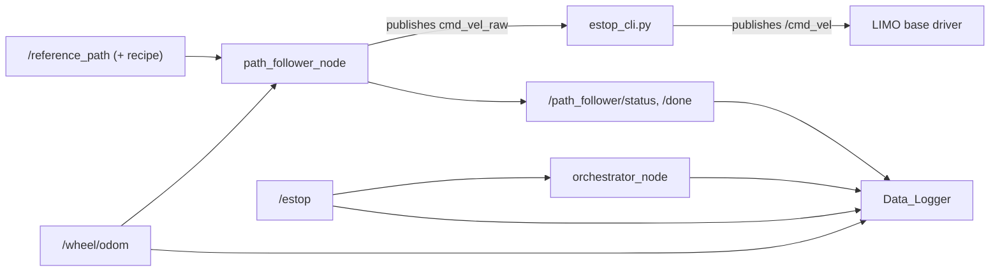
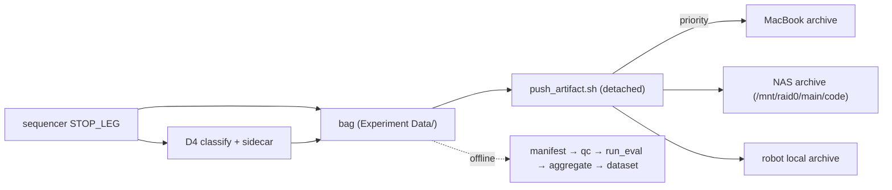

# Deployment & Runbook — NUC

How the stack gets onto a NUC and what each support script does. Pairs with
`CLAUDE.md` (dev cycle, ssh/rsync, build/run commands) and `system_spec.md`
(the interface contract the deployed system must satisfy).

## NUC deployment caveats

These four things are non-obvious and will re-bite anyone setting up a fresh
NUC. Keep them in mind before declaring a runtime environment "ready".

1. **Professor package shipped without `setup.cfg`.** Without the
   `[install] install_scripts=$base/lib/limo_path_follower` redirect, modern
   setuptools installs `console_scripts` into `install/<pkg>/bin/` instead of
   `install/<pkg>/lib/<pkg>/`, and `ros2 run limo_path_follower
   path_follower_node` returns "No executable found". Our fix added
   `scalecar-vfg-h-infinite/ros2_bridge/setup.cfg`. Every other ament_python
   package in `~/agilex_ws/src/` has the same pattern.

2. **`vfg_pathfollowing` is a hard prerequisite, not declared anywhere.**
   The ROS package's `package.xml` only lists `rclpy`, `nav_msgs`,
   `geometry_msgs`. The node imports `vfg_pathfollowing` at the top, so on
   a fresh NUC you must:
   ```
   pip3 install --user ~/H-infinity/scalecar-vfg-h-infinite/
   ```
   before `ros2 run` will succeed. If you skip this the node crashes with
   `ModuleNotFoundError: No module named 'vfg_pathfollowing'`.

3. **`setuptools==68.2.2` is pinned in `~/.local` on the NUC.** Versions
   >= 70 place `console_scripts` in `bin/` regardless of `setup.cfg` and
   silently break `ros2 run` for **all** ament_python packages on the
   workspace. If pip or a system update moves it, reinstall:
   ```
   pip3 install --user --force-reinstall setuptools==68.2.2
   ```

4. **Repo lives outside the colcon tree.** The clone is at `~/H-infinity/`;
   the package is made visible to colcon via a symlink:
   ```
   ln -sfn ~/H-infinity/scalecar-vfg-h-infinite/ros2_bridge \
           ~/agilex_ws/src/limo_path_follower
   ```
   Recreate the symlink if the repo moves.

## Support scripts inventory

The legacy `agile_ws` runtime stack that this project builds on. These are
infrastructure — reuse them, do not re-implement.

### Bring-up & platform access
- `start_ROS.sh` — runs environment setup and launches the robot stack.
- `env_sanitizer.sh` — sources ROS2 + the installed robot workspace; sets
  `ROS_DOMAIN_ID=0` and `ROS_LOCALHOST_ONLY=1` for reliable onboard control.

### Robot stack launch
- `src/limo_ros2/limo_base/launch/LIMO+MAVROS+RTK_Node_Launcher.launch.py` —
  launches `limo_base` (remaps `odom` → `/wheel/odom`), `mavros` in namespace
  `pixhawk`, and the standalone GNSS process. End-to-end behavior post
  systemd-install is not yet re-verified (see `ToDo.md`).

### Safety path
- `estop_cli.py` — subscribes `cmd_vel_raw`, publishes filtered `/cmd_vel` and
  `/estop`, forces zero velocity when E-stop is active. Also subscribes
  `/estop_trigger` (browser-driven) and is TTY-tolerant (runs under systemd).
  **This node must stay between the controller and `/cmd_vel`** — see the
  safety contract in `CLAUDE.md` and ADR-01.

### Data logging
- `Data_Logger.py` — wraps `ros2 bag record`; publishes `/data_logger/recording`
  and `/data_logger/health`. Records the GPS-RTK + Pixhawk GPS topics,
  `/cmd_vel`, `/cmd_vel_raw`, `/wheel/odom`, `/imu`, `/estop` (TOPICS list ~L30).
  The canonical required bag set is in `system_spec.md §4`.

### GNSS dataset support
- `GPS-RTK_ROS2_pub_node.py` — publishes GNSS fix / NMEA / RTK-status for the
  F9P RTK pipeline. The external FitTogether OHCOACH Cell is a standalone
  blackbox logging to its own SD card — see `network_topology.md`.

### Run-artifact analysis & backup (project tooling, not legacy)

The automatic per-leg pipeline: when the sequencer reaches `STOP_LEG` it (1)
stops the bag, (2) classifies the outcome (D4), (3) writes a sidecar, then (4)
fires the backup — all unattended. Offline, the analysis tools turn the archived
bags into a dataset + metrics.

- `tools/sync/push_artifact.sh` — runs on the NUC; fired detached by the
  sequencer (`_archive_leg`) after the bag + sidecar are finalized. Pushes the
  bag to **MacBook (priority) → NAS → local repo**, rate-limited (`--bwlimit`) +
  `nice`/`ionice` so it never disturbs the next leg. `.git` excluded; each target
  is its own **local-only git archive** (pre-push hook blocks upload; never
  GitHub, no LFS). Has connect-retries (Tailscale flap), `accept-new` host keys,
  and passes the spaced `Experiment Data` path raw (macOS rsync 2.6.9 rejects
  `-s`). Targets come from `scenarios/experiment.yaml` `artifact_sync`.
  *Verified end-to-end NUC→Mac+NAS 2026-05-26.*
- `tools/sync/sync.sh` — interim repo sync: `push` (laptop→NUC code, additive),
  `pull` (NUC→laptop artifacts), `init-artifacts` (make `Experiment Data/` a
  local-only repo). Direction of truth: code only laptop→NUC; artifacts only
  NUC→laptop.
- `tools/analysis/` — offline bag→dataset pipeline: `manifest.py` (index legs),
  `qc.py` (quality gates), `run_eval.py` (per-run metrics), `aggregate.py`
  (cross-run rollup), `build_dataset.py` + `export.py` (dataset emit),
  `make_sidecar.py` (sidecar for manual/indoor bags). Tests + fixtures under
  `tools/analysis/tests/`.

Backup vs. code paths are deliberately separate: **code** flows laptop→GitHub
(+ Syncthing to the NAS at `/mnt/raid0/main/code`); **artifacts** flow only via
the direct rsync above. `Experiment Data` is in the Syncthing `.stignore` on both
Mac and NAS so the two mechanisms never double-write. See `network_topology.md`
for transports and `memory`/sync notes for the routing rationale.

### Legacy / superseded (`legacy/`)
- `legacy/run_scenarios_from_files.py` — INI-driven scenario runner with
  topic/RTK-gated preflight and bag start/stop. Being superseded by the
  orchestrator (`orchestrator_node.py`) + battle station.
- `legacy/limo_scenario_motion.py` — pre-H∞ scripted heading-hold motion on
  `/wheel/odom`; an early practical motion baseline. The paper baseline is now
  PID-FF (`vfg_pathfollowing/controllers/pid_ff.py`) — see `experiment.md`.

## Minimum integration architecture



The authoritative interface contract (topic names, types, directions) is
`system_spec.md §4`; this diagram is the orientation view.

### Post-run: automatic analysis + backup

What happens after each leg ends, unattended (see the script inventory above):



Live path (classify/sidecar/push) runs on the robot per leg; the offline
analysis (`tools/analysis/`) runs against the archived bags to emit the dataset
+ metrics.
