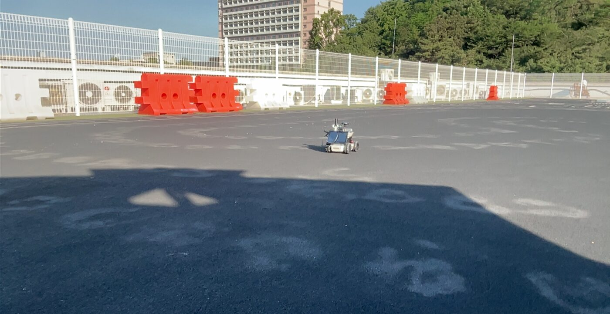
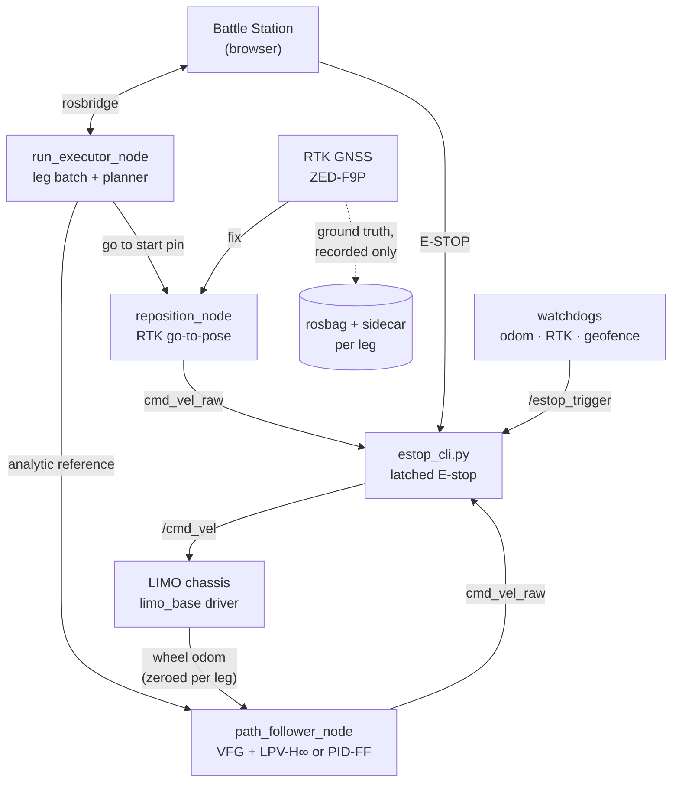

# H∞ LIMO — LPV-H∞ path following on a real robot

[](https://docs.ros.org/en/humble/)
[](scalecar-vfg-h-infinite/pyproject.toml)
[](https://github.com/agilexrobotics/limo-doc)
[](STATUS.md)

<p align="center">
  
</p>

This repo is the hardware follow-up to a simulation study of a **curvature–velocity
scheduled LPV-H∞ path-following controller** built on **vector field guidance
(VFG)**. It moves the controller off the simulator and onto an AgileX LIMO, and it
builds the system needed to compare it against **PID with curvature feed-forward
(PID-FF)** to a paper-grade standard. The runs happen on a rooftop track, with RTK
GNSS recorded as independent ground truth.

## The question

In simulation, the controller adapts its H∞ performance weighting through the
scheduling parameter **ρ = κv** (path curvature × speed) and beats PID-FF, with the
largest margin at moderate to high speed. The LIMO tops out at **1.0 m/s**, so the
hardware study holds speed fixed and **sweeps curvature** instead, moving along the
same ρ axis by a different route.

The working hypothesis is that, at fixed speed, LPV-H∞ tracks **more repeatably**
than PID-FF under real odometry and measurement disturbance across the reachable
curvature range ([`SPEC.md` §0](SPEC.md)). The hardware data has not confirmed it
yet; see [Status](#status).

## How it works



The Battle Station runs in a browser on the operator's laptop. Everything else runs
under ROS 2 on the LIMO's onboard NUC. The diagram is an orientation view; the full
topic contract is [`DOC/system_spec.md` §4](DOC/system_spec.md).

Each leg of a batch runs the same cycle. The robot drives itself to the next start
pin on RTK and stops the reposition mover there. It zeroes odometry at that pose,
waits for an RTK FIXED solution and starts a bag. Then the path follower takes over
and tracks the analytic reference. Every leg ends with a JSON sidecar that records
the cell parameters, venue, RTK quality and git commit.

A few design choices carry most of the weight:

- **Ground truth stays independent.** During a recorded run, wheel odometry is the
  controller's only feedback. RTK is recorded and never fed back
  ([ADR-01](DOC/decisions/01_gps_no_fusion.md)), so RTK-measured tracking error is
  not circular. Every metric is computed twice: once from the odometry belief, once
  from RTK truth.
- **One actuation path.** Every velocity command goes controller → `cmd_vel_raw` →
  latched E-stop → `/cmd_vel`. Exactly one node publishes `cmd_vel_raw` at a time,
  the follower or reposition, never both.
- **Exact references.** Step-curvature, slalom and the wiggle families
  (sine, chirp, square) are generated analytically, so the robot tracks the same
  curve the simulator does.
- **Fail safe, then page.** Any fault stops the robot in place. The geofence
  watchdog latches the E-stop, and the RTK and odometry watchdogs pause the batch or
  restart the chassis driver. All of them post alert cards to the Battle Station.
  Pressing Start again resumes the batch by rescanning the recorded bags, so cells
  that already passed are not repeated.

## Experiment at a glance

| Axis | Values |
|---|---|
| Controller | `lpv-hinf`, `pid-ff` |
| Speed | 1.0 m/s (primary), 0.5 m/s (sim-comparable check) |
| Path family | step-curvature, slalom, wiggle_sine, wiggle_chirp, wiggle_square |
| Radius R | step and slalom: 1.0, 0.7, 0.5, 0.4 m · wiggle: 2.0, 1.5, 1.2 m |
| Repetitions | N = 10 per cell |

That comes to **68 cells × 10 = 680 recorded runs**. Each cell is compared with a
Wilcoxon signed-rank test, LPV-H∞ against PID-FF. The full matrix and operating
model are in [`DOC/experiment.md`](DOC/experiment.md).

## Status

Rooftop data collection is in progress, and one known issue affects the existing
runs: the stock chassis driver delivered only ~0.4× the commanded steering, and its
odometry was skewed. A patched driver is installed since 2026-10-07. Progress,
known issues and next steps are in **[STATUS.md](STATUS.md)**.

## Getting started

### Try the controller in simulation (no robot needed)

```bash
pip install -e scalecar-vfg-h-infinite
```

```python
import matplotlib.pyplot as plt
from vfg_pathfollowing import Simulator, StepCurvaturePath

path = StepCurvaturePath(R=0.5, theta_arc=1.57)   # straight → arc → straight
sim = Simulator(path, controller='lpv-hinf', speed=1.0)
results = sim.compare(controllers=['lpv-hinf', 'pid-ff'], T=10.0)
Simulator.plot_comparison(results, path=path)
plt.show()
```

Tuning parameters, path types and notebooks are covered in the library's
[README](scalecar-vfg-h-infinite/README.md) (Korean).

### Run the checks (no robot needed)

```bash
python3 tools/qc/run_qc.py laptop   # unit + vendored library + analysis pipeline
```

The other tiers (ROS sim on the robot, field-gated) are in
[`tools/qc/README.md`](tools/qc/README.md).

### On the robot

Hardware: an AgileX LIMO with its onboard NUC on ROS 2 Humble, a helical u-blox
ZED-F9P RTK rover, and an RTK base station (a base F9P plus a Raspberry Pi
broadcaster from [`tools/rtk_base/`](tools/rtk_base/)).

1. Read [`DOC/deployment.md`](DOC/deployment.md), starting with **"Gotchas that
   will bite you"**. It covers four failure modes that look like your bug and are
   not.
2. Build the ROS 2 package on the NUC:
   ```bash
   cd ~/agilex_ws && colcon build --packages-select limo_path_follower
   ```
3. Bring up the stack through the `limo-battle` service
   ([`tools/orchestrator/`](tools/orchestrator/)), then open the Battle Station
   ([`tools/path_gen/interactive.html`](tools/path_gen/interactive.html)) and connect
   over rosbridge.
4. For a field session, follow the runbook in
   [`DOC/agent_field_runbook.md`](DOC/agent_field_runbook.md).

For a short indoor shakedown before the rooftop, see
[`tools/indoor_test/`](tools/indoor_test/).

## Repository layout

```
.
├── scalecar-vfg-h-infinite/   controller library (vendored, MIT)
│   ├── vfg_pathfollowing/     VFG guidance, LPV-H∞ and PID-FF, simulator (upstream)
│   └── ros2_bridge/           our ROS 2 package limo_path_follower: follower, run
│                              executor, planner, wiggle paths, reposition, odom zero
├── tools/
│   ├── path_gen/              Battle Station web UI: map, path designer, run control
│   ├── analysis/              bag → per-leg metrics → per-cell statistics → dataset
│   ├── safety/                odometry, RTK and geofence watchdogs
│   ├── orchestrator/          limo-battle systemd service and start_battle.sh
│   ├── sync/                  code deploy (laptop → relay → robot), artifact pull
│   ├── rtk_base/              RTK base-station broadcaster for the Raspberry Pi
│   ├── qc/                    QC harness (laptop, ROS-sim and field-gated tiers)
│   ├── indoor_test/           indoor sample curve for shaking out the stack
│   └── …                      network, preflight, ops, launch, notify, gnss, udev,
│                              diagnostics
├── scenarios/                 experiment matrix (experiment.yaml) and venues/
├── src/limo_ros2/             limo_base chassis-driver launch files
├── tests/qc/                  contract and pipeline tests
├── estop_cli.py               latched E-stop: the only path to /cmd_vel
├── Data_Logger.py             rosbag recorder wrapper
├── GPS-RTK_ROS2_pub_node.py   RTK rover node (RTCM in, fix out)
├── DOC/                       specs, runbooks, ADRs, the simulation paper
└── legacy/                    superseded scripts kept for reference
```

Notes for contributors:

- `run_executor_node` drives the live experiment. `experiment_sequencer_node` has
  been **deprecated** since 2026-06-12 and is kept only for the `sequencer_smoke`
  end-to-end smoke test.
- `scalecar-vfg-h-infinite/` is a vendor drop. Keep upstream drops in separate
  commits from our patches so later drops diff cleanly.
- The edit → sync → build → verify loop and the safety contract are in
  [`CLAUDE.md`](CLAUDE.md).

## Documentation

| Doc | Owns |
|---|---|
| [`DOC/system_spec.md`](DOC/system_spec.md) | **What the system must be**: the locked requirements, the canonical interface contract (§4) and the acceptance criteria. Start here. |
| [`DOC/experiment.md`](DOC/experiment.md) | **Why and how**: the curvature-sweep pivot, the experimental matrix, the per-cell operating model and the orchestrator target state. |
| [`SPEC.md`](SPEC.md) | **Follow-up paper spec**: controller topologies and exact configuration, the hardware-envelope measurement protocol (M1–M4), bag-mined findings and the steering-scale root cause (§7.8). |
| [`DOC/deployment.md`](DOC/deployment.md) | NUC deployment caveats, the support-script inventory, data-flow diagrams and the runbook. |
| [`DOC/agent_field_runbook.md`](DOC/agent_field_runbook.md) | Starting the autonomous test from a cold boot and supervising it live, with a monitoring matrix and a normal-vs-intervene table. |
| [`DOC/network_topology.md`](DOC/network_topology.md) | The field network (phone tether + LIMO AP) and the RTK base subtopology. |
| [`DOC/decisions/`](DOC/decisions/) | Architecture Decision Records. ADR-01 keeps GNSS out of the control loop. |
| [`DOC/paper_ijat.pdf`](DOC/paper_ijat.pdf) | The simulation paper this work follows up on. |
| [`STATUS.md`](STATUS.md) | Public status snapshot: progress, known issues and next steps. |
| [`ToDo.md`](ToDo.md) | Live working checklist and the detailed dated status log. Canonical for current status. |
| [`CLAUDE.md`](CLAUDE.md) | Agent operating manual: the dev cycle, ssh/rsync, build and run, the safety contract and conventions. |

If a fact lives in two docs, this table says which copy is canonical. Fix that one.

## Acknowledgements and license

The controller, guidance law and simulator come from
[`scalecar-vfg-h-infinite`](scalecar-vfg-h-infinite/) by Suwon Lee (Kookmin
University), released under the [MIT License](scalecar-vfg-h-infinite/LICENSE).
The simulation study is S. Lee, *Curvature-Velocity Scheduled LPV H∞
Path-Following Controller Design via Vector Field Guidance*
([`DOC/paper_ijat.pdf`](DOC/paper_ijat.pdf)).
