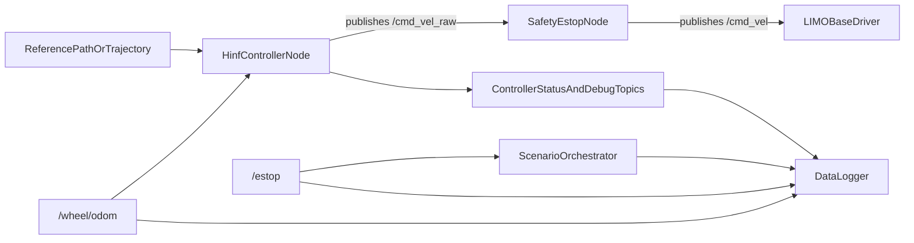

# H-infinity LIMO Project Specification

## 1. Reasonability Check

This project is technically reasonable if it is treated as an integration and evaluation project, not a controller synthesis project.

Two scope corrections are important:

- The H-infinity controller itself is assumed to be provided by the professor. Controller derivation, gain design, and proof of stability are out of scope for this project unless additional materials are later supplied.
- The relevant `agile_ws` runtime and support files are already present in this repository. The remaining work is therefore controller integration and stack unification, not re-importing the GNSS/experiment infrastructure.
- The existing ROS2/GNSS stack does not already contain an H-infinity control stack. It should be reused as infrastructure, not described as if the controller is already implemented.

## 2. Project Goal

Implement the professor-provided H-infinity path-following controller on the physical AgileX LIMO platform and evaluate how well the behavior demonstrated in simulation transfers to real hardware under actual sensing, actuation, safety, and environment constraints.

The project is therefore not only a controller-integration task. It is also a sim-to-real evaluation task whose outputs should show:

- whether the controller can be deployed safely in the existing ROS2 stack
- how real-hardware behavior differs from the simulation study
- whether the remaining gap can be handled by interface adaptation and conservative tuning, or indicates a deeper plant-model mismatch
- whether the experiment pipeline preserves enough GNSS and run-traceability information for offline analysis and external dataset association

## 3. In Scope

- Integrate the provided controller into the existing ROS2 control pipeline on the LIMO.
- Adapt the simulation-oriented controller interface to the real robot without bypassing the existing safety path.
- Reuse existing bring-up, safety, logging, and scenario infrastructure where practical.
- Define a canonical interface between the controller and the existing stack.
- Run repeatable experiments on the robot.
- Evaluate sim-to-real transfer by comparing real-hardware behavior against the simulation-side expectations from the professor's work.
- Identify major mismatch sources such as speed limits, saturation, odometry quality, timing, and vehicle-model error.
- Record and analyze controller performance from rosbag data.
- Preserve and collect GNSS datasets from the existing stack, including GPS and GPS-RTK outputs.
- Associate each experiment run with externally collected Ohcoach-cell NTRIP-related data.
- Use RTK-quality GNSS data as semi-ground truth for controller evaluation when fix quality is sufficient.
- Compare controller behavior against a manual or existing non-H-infinity operating workflow.

## 4. Out of Scope

- H-infinity controller synthesis, tuning, or theoretical derivation.
- Claims of scientific superiority over PID, MPC, or other advanced controllers unless those controllers are also implemented and tested in the same ROS2 stack.
- Full localization redesign.
- Major changes to the LIMO base driver unless required for compatibility.
- Direct code-level interaction with the Ohcoach-cell NTRIP hardware, which operates independently from the ROS2 stack.

## 5. Deployment Context

- Target platform: Intel NUC mounted on the AgileX LIMO.
- Runtime environment: ROS2 on the robot-side computer.
- The relevant `agile_ws`-derived runtime files are already present in this repository.
- Intended execution location on the robot: user stated `~/agiles_ws`.
- Existing environment script currently sources `~/agilex_ws/install/setup.bash`.
- The LIMO firmware imposes a global speed cap of `1.0 m/s`.
- This cap also constrains turning behavior: if the commanded turn would require wheel speed beyond the firmware limit, the robot will widen the effective turning radius instead of realizing the nominal curvature command.

This path mismatch must be resolved before implementation. The spec assumes the final deployed workspace path will be standardized during integration.

## 6. Existing Assets To Reuse

The following assets are already present in this repository, copied from the existing `agile_ws` runtime stack, and should be treated as the base infrastructure for this project.

### 6.1 Bring-up and Platform Access

- `start_ROS.sh`
  - Runs the environment setup and launches the robot stack.
- `env_sanitizer.sh`
  - Sources ROS2.
  - Sources the installed robot workspace.
  - Sets `ROS_DOMAIN_ID=0`.
  - Sets `ROS_LOCALHOST_ONLY=1` for more reliable onboard control.

### 6.2 Robot Stack Launch

- `src/limo_ros2/limo_base/launch/LIMO+MAVROS+RTK_Node_Launcher.launch.py`
  - Launches `limo_base`.
  - Remaps `odom` to `/wheel/odom`.
  - Launches `mavros` in namespace `pixhawk`.
  - Starts the standalone GNSS process.

### 6.3 Safety Path

- `estop_cli.py`
  - Subscribes to `cmd_vel_raw`.
  - Publishes filtered `cmd_vel`.
  - Publishes `/estop`.
  - Forces zero velocity when E-stop is active.

This existing topic contract is central to the project and should be preserved unless there is a strong reason to redesign it.

### 6.4 Experiment Orchestration

- `run_scenarios_from_files.py`
  - Loads scenario definitions from INI files.
  - Performs preflight checks for topics, publishers, subscribers, and message flow.
  - Can gate execution on RTK status in the existing GNSS workflow.
  - Publishes `/scenario_runner/status` and `/scenario_runner/event`.
  - Starts and stops the bag recorder.

For the combined GNSS + controller dataset objective, RTK gating should generally remain available and be enabled whenever a run is intended to produce RTK-based semi-ground-truth intervals.

### 6.5 Data Logging

- `Data_Logger.py`
  - Wraps `ros2 bag record`.
  - Publishes `/data_logger/recording` and `/data_logger/health`.
  - Already records the current baseline topics:
    - `/gps_rtk_f9p_helical/gps/fix`
    - `/gps_rtk_f9p_helical/gps/nmea`
    - `/gps_rtk_f9p_helical/gps/rtk_status`
    - `/pixhawk/global_position/raw/satellites`
    - `/pixhawk/global_position/raw/fix`
    - `/pixhawk/gpsstatus/gps1/raw`
    - `/cmd_vel`
    - `/cmd_vel_raw`
    - `/wheel/odom`
    - `/imu`
    - `/estop`

### 6.6 Existing Motion Baseline

- `limo_scenario_motion.py`
  - Publishes `cmd_vel_raw`.
  - Uses `/wheel/odom` for simple heading-hold and motion stopping logic.
  - Represents the current non-H-infinity motion behavior that can be used as a practical baseline reference.

### 6.7 Existing GNSS Dataset Support

- `GPS-RTK_ROS2_pub_node.py`
  - Publishes GNSS fix, NMEA, and RTK status topics for the F9P-based RTK pipeline.
- The current stack already supports collection of GPS and GPS-RTK-related ROS data.
- The Ohcoach-cell NTRIP-related dataset is collected independently by external hardware and does not require new ROS2 code-level interaction.

## 7. System Architecture

The minimum intended integration architecture is shown below.

## 8. Software Architecture Decision

The project should preserve the existing command chain:

1. The H-infinity controller publishes `cmd_vel_raw`.
2. The existing safety layer filters that command and publishes `cmd_vel`.
3. The LIMO base consumes `cmd_vel`.

This design is preferred because it keeps the safety/E-stop logic outside the controller and reduces the risk that a controller-side fault bypasses stopping authority.

## 9. New Components Required

The following functionality is not yet present and must be added during implementation.

### 9.1 H-infinity Controller Runtime Node

A new node or adapter process is required to:

- receive the professor-provided controller implementation
- subscribe to robot state feedback
- consume a path or trajectory reference
- generate velocity commands for the existing control path
- publish diagnostics for evaluation

### 9.2 Reference Input Source

The H-infinity controller needs a reference to follow. The spec assumes one of the following:

- a path topic generated by a scenario runner
- a trajectory topic generated offline and published during tests
- a wrapper that converts the existing scenario format into a controller reference stream

If the professor-supplied controller expects a different interface, an adapter layer shall be used rather than rewriting the existing safety pipeline.

### 9.3 Minimum Evaluation Data Streams

The current logger topic inventory does not by itself define the project dataset. The minimum evaluation dataset shall be defined by the data streams needed to reconstruct the commanded reference, the realized control path, the safety state, the RTK-backed evaluation intervals, and the association between each ROS run and the external Ohcoach-cell dataset.

### 9.4 GNSS Dataset Preservation

The controller integration must not break the existing GNSS data collection path. The target system should allow a single experiment run to support:

- GNSS performance evaluation across GPS and GPS-RTK outputs
- association with the independently collected Ohcoach-cell NTRIP-related dataset
- H-infinity controller evaluation using RTK-quality GNSS as semi-ground truth when available

## 10. Canonical Controller Interface Contract

This section defines the expected minimum ROS2 interface for integration. If the delivered controller uses different topic names or message types, a compatibility wrapper should be added so the rest of the system can remain stable.

### 10.1 Required Controller Inputs

| Topic | Type | Producer | Purpose |
|---|---|---|---|
| `/wheel/odom` | `nav_msgs/msg/Odometry` | `limo_base` | Main onboard feedback for pose, heading, and velocity |
| `/estop` | `std_msgs/msg/Bool` | `estop_cli.py` | Optional stop awareness inside the controller or wrapper |
| `/scenario_runner/reference_path` | TBD | scenario/reference publisher | Path or trajectory to follow |

Notes:

- The exact reference message may be `nav_msgs/msg/Path`, a custom waypoint message, or another professor-defined format.
- Because the delivered controller interface is not yet known, the reference topic name and type remain provisional.

### 10.2 Required Controller Output

| Topic | Type | Consumer | Purpose |
|---|---|---|---|
| `cmd_vel_raw` | `geometry_msgs/msg/Twist` | `estop_cli.py` | Raw motion command from controller to safety layer |

### 10.3 Recommended Diagnostic Outputs

| Topic | Type | Purpose |
|---|---|---|
| `/hinf_controller/status` | `std_msgs/msg/String` or custom status | Human-readable state and mode |
| `/hinf_controller/tracking_error` | custom or scalar messages | Cross-track and heading error logging |
| `/hinf_controller/reference` | same as reference input or derived | Records the active target used by the controller |
| `/hinf_controller/debug_cmd` | `geometry_msgs/msg/Twist` or custom | Optional pre-saturation or internal command debug |

These diagnostics are recommended because controller evaluation is much weaker if only `cmd_vel_raw` and odometry are logged.

## 11. Launch and Execution Contract

The expected run sequence on the Intel NUC is:

1. Start the ROS2 environment and robot bring-up.
2. Start the safety/E-stop node.
3. Start the H-infinity controller node or wrapper.
4. Start the scenario/reference publisher.
5. Start the recorder.
6. Execute the experiment.

### 11.1 Existing Launch Pieces To Preserve

- `start_ROS.sh` for platform bring-up.
- `estop_cli.py` for command filtering and stopping authority.
- `run_scenarios_from_files.py` for orchestration, if adapted for controller experiments.
- `Data_Logger.py` for bag recording.

### 11.2 Likely Integration Options

- Option A: extend the existing launch flow with an additional controller launch file.
- Option B: keep controller startup as a separate terminal/process during early integration.

Option B is acceptable for initial bring-up. Option A is preferred for repeatable evaluation runs.

If `run_scenarios_from_files.py` is reused for controller experiments, its GNSS-oriented preflight defaults should be adapted so that controller runs are not blocked by irrelevant RTK requirements.

## 12. Baseline Definition

The default comparison baseline for this project is a practical manual baseline, not a formal controller benchmark suite.

Recommended baseline order:

1. Existing scripted motion behavior from `limo_scenario_motion.py` where applicable.
2. Operator-guided manual path execution if scripted comparison is not sufficient.

This is acceptable for an engineering integration study, but it is scientifically weaker than comparison against well-defined automatic baselines such as PID or MPC under the same path-tracking task. The final report should state this limitation explicitly.

## 13. Experiment Design

The evaluation should progress in stages.

### 13.1 Stage 0: Static Safety Validation

Purpose:

- verify that the controller starts correctly
- verify that E-stop always overrides controller output
- verify that zero or bounded commands are produced when reference input is absent or invalid

### 13.2 Stage 1: Low-Speed Functional Tracking

Purpose:

- verify basic path following at conservative speed
- confirm that the controller can complete runs without safety intervention

Candidate scenarios:

- straight line path
- constant curvature path
- gentle lane-change or slalom path

### 13.3 Stage 2: Baseline Comparison

Purpose:

- compare H-infinity behavior against the practical manual baseline under the same route and speed envelope

Candidate comparisons:

- same start and end points
- same nominal path geometry
- same approximate speed envelope
- same test surface and environment

### 13.4 Stage 3: Robustness Checks

Purpose:

- observe controller behavior under less ideal conditions without intentionally creating unsafe situations

Candidate checks:

- moderate speed increase
- repeated runs across batteries or sessions
- mild trajectory changes
- temporary reference disturbances or restart conditions if safely supported

## 14. Performance Metrics

The project shall evaluate controller performance using controller-relevant metrics while also preserving the existing GNSS dataset objective.

### 14.1 Primary Metrics

- lateral tracking error
  - RMS error
  - maximum absolute error
- heading error
  - RMS error
  - maximum absolute error
- path completion success
  - completed or aborted
- settling or recovery time
  - after path curvature change, startup, or disturbance
- E-stop interventions
  - count and cause

### 14.2 Secondary Metrics

- control smoothness
  - total variation of linear velocity command
  - total variation of angular velocity command
- oscillation indicators
  - repeated sign changes or peak counts in heading error and angular command
- command effort
  - average and peak commanded speed and yaw rate
- run repeatability
  - variation of key metrics across repeated trials

### 14.3 Optional Metrics

- integrated absolute lateral error
- time inside a tolerance band
- energy or battery impact if instrumentation is available

### 14.4 GNSS Dataset Metrics

In addition to controller metrics, each run should preserve the GNSS-analysis value of the dataset. Relevant GNSS-side quantities include:

- fix class or quality over time
- time spent in RTK FIXED, RTK FLOAT, and lower-quality states
- fix loss and re-fix events
- correction-availability context when it can be associated from the external Ohcoach-cell dataset

## 15. Logging Requirements

The recording plan shall be minimal but sufficient to reconstruct the commanded experiment, the realized control path, the safety state, and the RTK-backed evaluation intervals. The minimum required dataset is therefore defined by analysis need, not by the current `Data_Logger.py` topic inventory.

### 15.1 Minimum Required Runtime Data Streams

- controller reference stream, or an immutable reference file linked to the run metadata
- `/wheel/odom`
- `/cmd_vel_raw`
- `/cmd_vel`
- `/estop`
- `/scenario_runner/event`, or one equivalent run-event stream
- `/gps_rtk_f9p_helical/gps/fix`
- `/gps_rtk_f9p_helical/gps/rtk_status`
- run ID
- scenario identity or reference-file identity
- UTC start and stop times
- run outcome and abort reason
- controller type and parameter snapshot for the run

Notes:

- `/scenario_runner/status` is useful but not required if the event stream already records run lifecycle transitions.
- `/imu`, NMEA, satellite-count, and Pixhawk raw-GPS topics are not part of the minimum dataset unless a separate GNSS-diagnostics objective is added.
- A plain-GPS fix topic may be added if the study explicitly compares GPS and GPS-RTK behavior within the same run.

### 15.2 External NTRIP-Associated Dataset

In this project, "NTRIP data" refers to data collected by the independently operating Ohcoach-cell hardware that receives RTK correction data from an NTRIP service via hotspot.

- No new ROS2 code-level interaction is assumed for this hardware.
- The external dataset should be associated with each experiment run by time, run ID, or operator log.
- The recorded dataset shall include enough time-alignment metadata to link the ROS run to the external Ohcoach-cell data.
- If reliable synchronization metadata is not available, this limitation must be documented in the analysis.

### 15.3 Optional Additional Data Streams

- `/data_logger/recording`
- `/data_logger/health`
- `/scenario_runner/status`
- steering-angle or Ackermann telemetry if available at runtime
- any fused pose topic used for offline evaluation
- plain-GPS diagnostic topics if GPS-versus-RTK comparison is part of the experiment objective

### 15.4 Semi-Ground-Truth Policy

- RTK-quality GNSS should be used as semi-ground truth for path-relative error when the fix quality is sufficient, ideally RTK FIXED.
- Wheel-encoder odometry should be treated primarily as onboard control feedback and as a fallback analysis source, not as the preferred path-error truth source.
- If RTK quality drops below the accepted threshold, the corresponding intervals should be marked accordingly during analysis.

### 15.5 Data Quality Rule

A run should not be treated as valid for analysis unless:

- the bag starts before motion begins
- the bag ends after motion finishes or aborts
- all minimum required runtime data streams are present
- message flow is continuous enough for analysis
- RTK quality intervals are identifiable from the recorded data
- the reason for abort, if any, is recorded

## 16. Scenario Specification Requirement

Controller evaluation scenarios should be stored as data, not hardcoded logic.

The scenario format should include:

- scenario name
- path type
- path parameters
- nominal speed
- maximum run time
- safety limits
- notes for experiment execution

If the current INI-based scenario files are reused, they may need to be extended to include path-following references rather than only motion parameters.

## 17. Safety Requirements

The project shall preserve the following safety rules.

- E-stop must have higher authority than the controller.
- The controller must not publish directly to the final base command topic unless the safety layer is explicitly redesigned and revalidated.
- Missing reference data shall default to safe behavior.
- Controller startup and shutdown behavior must be bounded and predictable.
- Test runs shall begin at low speed before expanding the operating envelope.

## 18. Acceptance Criteria

The project is considered successfully implemented when all of the following are satisfied.

### 18.1 Integration Acceptance

- The H-infinity controller can be started on the Intel NUC together with the existing LIMO ROS2 stack.
- The controller receives required feedback and reference inputs.
- The controller publishes `cmd_vel_raw`.
- The safety node continues to arbitrate motion through `cmd_vel`.
- The deployed controller is tested within a speed and curvature envelope consistent with the LIMO firmware `1.0 m/s` cap.

### 18.2 Safety Acceptance

- Manual E-stop always stops the robot.
- E-stop state is logged.
- Controller behavior during startup, stop, and abort is bounded and documented.

### 18.3 Data Acceptance

- The recorded dataset contains all required control-path, event, GNSS, and run-metadata streams.
- Runs can be replayed offline for metric extraction.
- Scenario identity and run outcome are traceable from recorded data.
- External Ohcoach-cell NTRIP-related data can be associated with the run, or the absence of such association is explicitly documented.

### 18.4 Evaluation Acceptance

- At least one low-speed path-following scenario is completed repeatedly without unsafe behavior.
- The same scenario is executed under the selected manual baseline.
- The final analysis reports the agreed tracking metrics and explicitly states the baseline limitations.
- The final analysis states how the observed real-hardware behavior compares with the simulation-side expectation and identifies the main sim-to-real mismatch sources.

## 19. Risks and Constraints

- The professor-provided controller interface is currently unknown.
  - Mitigation: add a wrapper node rather than rewriting the surrounding ROS2 stack.
- The workspace path naming is inconsistent (`agile_ws`, `agiles_ws`, `agilex_ws`).
  - Mitigation: standardize deployment paths before implementation.
- The LIMO firmware applies a global `1.0 m/s` speed cap, which can enlarge the effective turning radius when curvature commands would otherwise demand higher wheel speed.
  - Mitigation: design scenarios and interpret results using a coupled speed-curvature envelope rather than assuming the simulated path curvature is always physically realizable at the commanded speed.
- `/wheel/odom` may drift and is not a high-accuracy ground truth source.
  - Mitigation: use RTK-quality GNSS as the preferred semi-ground-truth source whenever fix quality is sufficient.
- The existing workspace contains GNSS-oriented evaluation logic.
  - Mitigation: preserve that GNSS value and add controller-specific metrics rather than replacing the existing dataset objective.
- The Ohcoach-cell NTRIP-related dataset is external to the ROS stack.
  - Mitigation: define a clear run-to-dataset association procedure based on timestamps or operator logs.
- A manual baseline is less rigorous than controller-to-controller comparison.
  - Mitigation: present results as an engineering evaluation unless stronger baselines are later implemented.

## 20. Deliverables

- H-infinity controller integration into the existing LIMO ROS2 stack
- repeatable launch and execution procedure on the Intel NUC
- synchronized rosbag dataset supporting both controller evaluation and GNSS evaluation
- associated Ohcoach-cell NTRIP-related dataset for runs where it is collected
- offline analysis outputs for tracking metrics
- brief evaluation report summarizing controller behavior, GNSS dataset quality, and comparison against the practical baseline

## 21. Immediate Next Implementation Targets

1. Confirm the professor-provided controller runtime interface.
2. Standardize the robot workspace path and environment sourcing.
3. Create the controller wrapper node if message types or topic names do not match the canonical contract.
4. Define the minimum recording set and add only the required missing streams.
5. Define a run-identification or time-synchronization procedure for the external Ohcoach-cell NTRIP-related dataset.
6. Define one low-speed reference path and complete an end-to-end trial.

## 22. Workflow To Adapt `scalecar-vfg-h-infinite` To Real LIMO Hardware

This workflow is reasonable if the professor-provided package is treated as a reusable controller and guidance library, not as a robot-ready deployment stack.

The key engineering assumption that must be checked early is whether the real AgileX LIMO behaves closely enough to the scale-car-oriented model embedded in the simulation package. If the mismatch is modest, interface adaptation and parameter tuning may be sufficient. If the mismatch is large, controller re-synthesis may eventually be required outside this repository.

### 22.1 Reuse Strategy

The preferred reuse strategy is:

- reuse `VectorFieldGuidance`
- reuse `LPVHinfController`
- reuse the ROS2 node structure in `scalecar-vfg-h-infinite/ros2_bridge/limo_path_follower/path_follower_node.py`
- replace the demo-only path source, topic names, and deployment assumptions
- preserve the existing LIMO safety path through `cmd_vel_raw` -> `estop_cli.py` -> `cmd_vel`

The simulation package should therefore be treated as a controller runtime source, not as the final authority for robot I/O, safety, launch, or experiment logging.

### 22.2 Main Gaps Between The Professor Code And The Current LIMO Stack

The current professor-provided ROS2 bridge is close to the required shape, but it still has several hardware-integration gaps:

- it subscribes to `/odom`, while the current LIMO stack uses `/wheel/odom`
- it publishes directly to `/cmd_vel`, while this project requires publishing to `cmd_vel_raw`
- it uses a hardcoded demonstration path rather than a runtime reference input
- it assumes a wheelbase and steering limits derived from the simulation package defaults
- it approximates steering feedback with the previous command rather than confirmed hardware steering telemetry
- it does not yet publish the controller diagnostics needed for evaluation and logging

### 22.3 High-Level Porting Workflow

#### Stage A: Freeze The Interfaces

Purpose:

- prevent unnecessary controller rewrites
- isolate robot-specific adaptations to a wrapper or bridge layer

Required decisions:

- confirm the professor package entry points to reuse
- define the reference input type to be used on the robot
- define the odometry topic and frame conventions
- preserve the existing safety-chain topic contract

Expected output:

- a written interface definition for controller inputs, outputs, and diagnostics

#### Stage B: Create The Robot Adapter Node

Purpose:

- make the simulation-side controller executable inside the real ROS2 stack

Required work:

- import the professor package into the ROS2 runtime environment on the NUC
- adapt the existing `path_follower_node.py` pattern into a controller wrapper node
- subscribe to `/wheel/odom` or add a small adapter if another odometry source is preferred
- publish `cmd_vel_raw` instead of `/cmd_vel`
- add safe zero-command behavior for missing odometry, missing reference, and shutdown

Expected output:

- a controller node that runs on the NUC and produces bounded raw commands without bypassing the safety layer

#### Stage C: Replace The Demo Path With A Real Reference Source

Purpose:

- make the controller follow experiment-defined paths rather than a hardcoded simulation path

Required work:

- choose whether the reference source will be `nav_msgs/msg/Path`, a waypoint file, or a scenario-to-path adapter
- convert the existing scenario representation if needed
- ensure the controller and reference use the same coordinate frame
- define how path completion, restart, and invalid-reference cases behave

Expected output:

- a repeatable runtime reference path pipeline suitable for both testing and logging

#### Stage D: Validate Vehicle-Level Assumptions

Purpose:

- check whether the simulation assumptions are close enough to the real robot

Required checks:

- wheelbase value
- steering saturation
- practical speed range
- the coupled speed-curvature envelope imposed by the LIMO firmware `1.0 m/s` global speed cap
- effective controller sample period
- whether `cmd_vel` on the LIMO base behaves consistently with the bicycle-model conversion from steering angle to yaw rate
- whether steering-angle telemetry exists or must be approximated

Expected output:

- a first-pass hardware parameter set and a list of known model mismatches

#### Stage E: Integrate Logging And Experiment Control

Purpose:

- make hardware tests analyzable and repeatable

Required work:

- ensure the minimum recording set covers the reference, realized control path, safety state, run events, RTK fix, RTK status, and run-to-external-dataset association data
- decide when RTK gating is required and when it should be disabled
- define how external Ohcoach-cell data is associated with each run

Expected output:

- an end-to-end experiment pipeline that records both controller and GNSS-related data

#### Stage F: Run Staged Hardware Testing

Purpose:

- reduce risk before attempting more aggressive operation

Recommended order:

1. static safety test with zero or bounded outputs
2. low-speed straight-path tracking
3. low-speed constant-curvature tracking
4. gentle path transitions such as lane-change or slalom
5. repeated runs for baseline comparison
6. only then moderate speed increases if prior stages remain stable

Expected output:

- evidence that the controller is integrated safely and can complete low-speed path-following runs on the real robot

#### Stage G: Tune Or Escalate

Purpose:

- determine whether integration-level tuning is sufficient

Recommended tuning order:

1. control rate and wheelbase consistency
2. output saturation
3. `output_gain`
4. `K_ff`
5. `rho_scale`

Decision rule:

- if the robot behaves qualitatively like the simulation but needs margin and smoothness adjustments, continue tuning
- if the robot shows persistent structural mismatch, such as qualitatively wrong transient behavior under correct interfaces and conservative speeds, treat that as evidence that the bundled controller may not match the real plant closely enough

### 22.4 Practical Execution Sequence On The Robot

The expected practical execution sequence is:

1. source the robot environment and launch the LIMO stack
2. confirm odometry and safety topics are alive
3. start `estop_cli.py`
4. start the H-infinity wrapper node adapted from `scalecar-vfg-h-infinite`
5. start the reference-path publisher or scenario adapter
6. start rosbag recording
7. run the low-speed experiment
8. stop the run and verify logs before the next attempt

### 22.5 Acceptance View For This Workflow

This workflow should be considered successful when:

- the professor-provided controller code runs as part of the robot ROS2 stack
- the controller receives live robot feedback and a real runtime reference
- the controller publishes only `cmd_vel_raw`
- the safety path remains in authority
- the resulting runs are logged well enough to compare robot behavior against simulation expectations and baseline runs

## 23. Action Item List

1. Identify the exact Python entry points in `scalecar-vfg-h-infinite` that will be reused in the robot wrapper node.
2. Create a hardware-facing wrapper node based on `ros2_bridge/limo_path_follower/path_follower_node.py`.
3. Change the wrapper output from `/cmd_vel` to `cmd_vel_raw`.
4. Change the wrapper input from `/odom` to `/wheel/odom`, or add a deliberate adapter if another odometry source is selected.
5. Replace the hardcoded demo path with a runtime reference input.
6. Decide the reference format: `nav_msgs/msg/Path`, waypoint file, or scenario-to-path adapter.
7. Verify frame conventions so odometry and reference are expressed consistently.
8. Measure or confirm the real LIMO wheelbase, steering limit, and safe low-speed test envelope.
9. Check whether steering-angle telemetry exists; if not, document that steering feedback is being approximated.
10. Set an initial conservative `dt_ctrl`, `delta_max`, `output_gain`, `K_ff`, and `rho_scale` configuration for hardware tests.
11. Implement the minimum recording set: reference stream or immutable reference file, `/wheel/odom`, `/cmd_vel_raw`, `/cmd_vel`, `/estop`, one run-event stream, `/gps_rtk_f9p_helical/gps/fix`, `/gps_rtk_f9p_helical/gps/rtk_status`, and run-ID or time-alignment metadata for the external Ohcoach-cell dataset.
12. Decide when RTK gating is required for controller experiments and when it should be disabled.
13. Define a run-ID or timestamp procedure to associate each ROS run with the external Ohcoach-cell dataset.
14. Execute a static safety validation before any motion tests.
15. Execute a straight-line low-speed tracking test and inspect the resulting bag before continuing.
16. Execute low-speed curved-path tests only after the straight-path test is stable.
17. Compare robot logs against simulation expectations to determine whether tuning is sufficient or controller re-synthesis must be considered.
